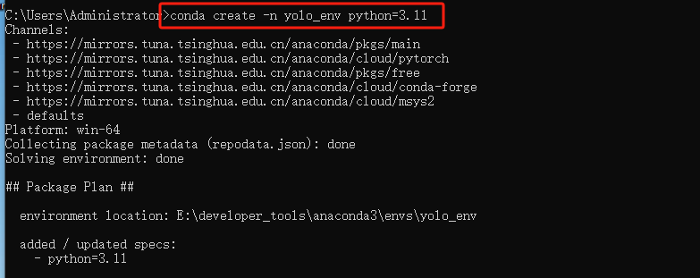
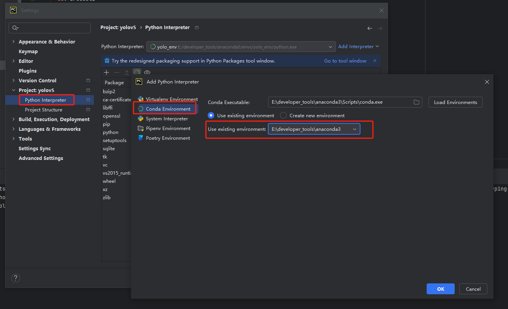
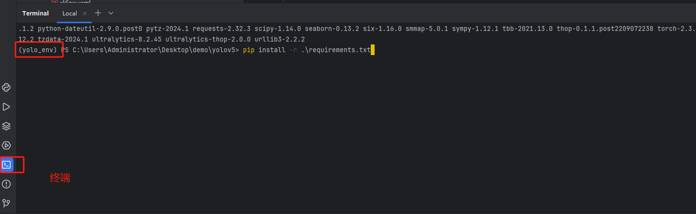
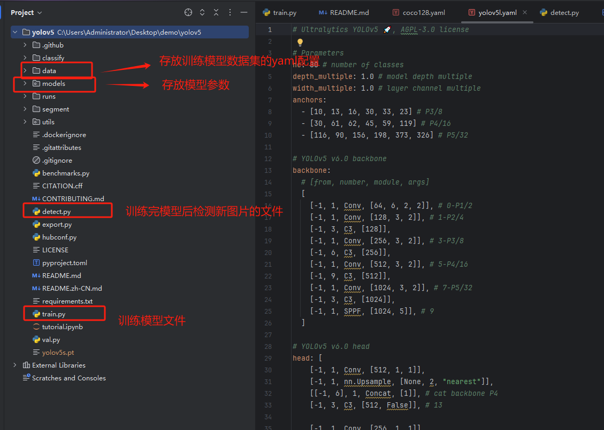
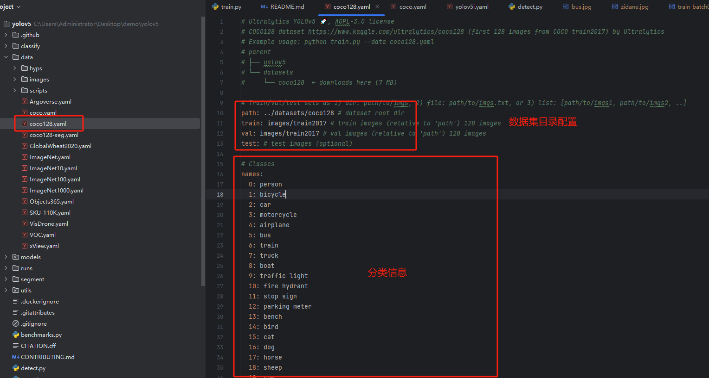
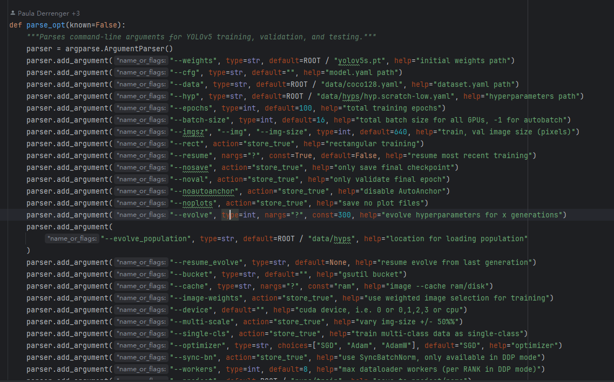
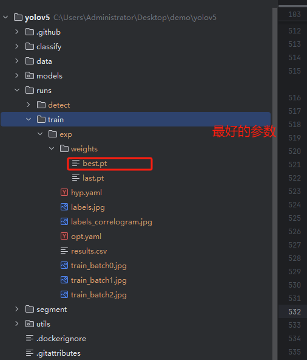
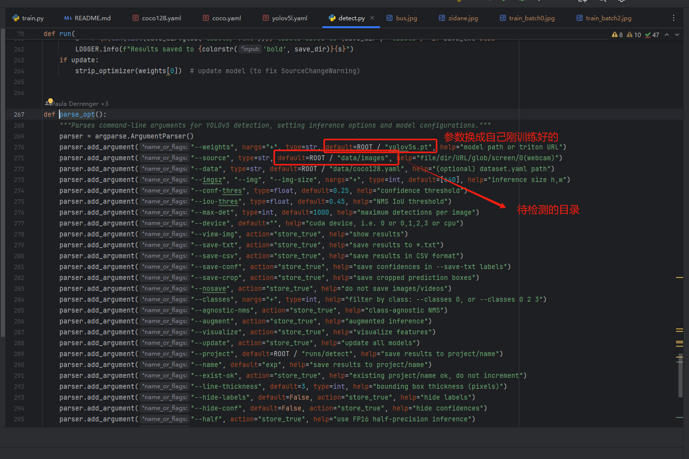

### yolo学习

这个文档主要记录怎么快速上手yolo，让它帮忙办事。因为只是学会使用，可以不需要知道原理。

目标：学会训练自己的模型。

1. 从github上把yolo的项目clone下来，后续将在这个项目上去拓展。
   
   `git clone https://github.com/ultralytics/yolov5.git`

2. 环境准备。建议使用conda给yolo的项目创建一个虚拟环境，随后在这个虚拟环境中安装其他的第三方库。
   
   - 创建虚拟环境 `conda create -n yolo_env python=3.11`
     
     
   
   - 将项目导入pycharm，配置好对应虚拟环境。
     
     
     
     
   
   - 在pycharm中打开terminal(一般会自动切换到配置的虚拟环境，如果没切换可以手动切换`activate env_name`)，在命令行安装依赖。`pip install -r .\requirements.txt`
     
     

3. 项目结构熟悉
   
   - 整体熟悉。
     
     
   
   - `train.py`  这个文件用来训练自己的模型时使用，可以在pycharm中直接执行这个文件的主函数，在没有对项目修改任何逻辑时，他会有如下操作。
     
     - 从官网下载预训练模型权重`yolov5s.pt`，往后训练时将以这个模型为起点去优化模型参数。可以这样理解，整个训练都是为了得到适应训练集的最优参数。
     
     - 下载官网的演示的coco数据集。
     
     - 开始训练及后续模型保存。
   
   - `detect.py` 这个文件用于加载已经训练好的模型参数，检测新的图片。
   
   - `data目录`，这里存放数据集的配置，比如指明训练数据集、验证数据集位置，以及分类信息。
     
     
   
   - `model目录` 存放模型的配置

4. 怎么训练自己的模型
   
   - 准备好数据集，详细的可以查看官方文档([Train Custom Data - Ultralytics YOLO Docs](https://docs.ultralytics.com/yolov5/tutorials/train_custom_data/#option-2-create-a-manual-dataset))
     
     - coco的数据集分析。
       
       - 整体目录结构
         
         ```
         datasets
              └── coco128
                       └── images
                                 └── aa.jepg
                       └── labels
                                 └── aa.txt
         ```
         
         数据集目录的主要组成一个是图片，一个是标注。官网这里说的很清楚，建议之间看上面的官网介绍。
         
         - 可以发现图片名和标注名除了文件后缀部分，相同。
         
         - 查看一个标注文件，里面的内容可能是这样的
           
           ```
           45 0.479492 0.688771 0.955609 0.5955
           45 0.736516 0.247188 0.498875 0.476417
           50 0.637063 0.732938 0.494125 0.510583
           45 0.339438 0.418896 0.678875 0.7815
           49 0.646836 0.132552 0.118047 0.0969375
           49 0.773148 0.129802 0.0907344 0.0972292
           49 0.668297 0.226906 0.131281 0.146896
           49 0.642859 0.0792187 0.148063 0.148062
           
           分类信息 中心点X坐标 中心点Y坐标 宽 高
           这里的坐标和宽高都是归一化的结果，分类信息是从一些数字  他们的详细含义在数据集的配置文件中可以查看
           ```
     
     - 怎么做数据集
       
       - 去网上找别人已经做好的
       
       - 使用labelimg或者roboflow自己做，最终的格式变成yolo需要的格式就行
     
     - 数据集配置文件
       
       - 需要标明数据集目录、分类信息
     
     - 自定义自己的模型(可选、此处不展开)
   
   - `train.py`的配置
     
     - 配置的主要位置在该文件的`parse_opt`函数)
       
       
       
       ```
       opt模型主要参数解析：
       > --weights：初始化的权重文件的路径地址
       > --cfg：模型yaml文件的路径地址
       > --data：数据yaml文件的路径地址
       > --hyp：超参数文件路径地址
       > --epochs：训练轮次
       > --batch-size：喂入批次文件的多少
       > --img-size：输入图片尺寸
       > --rect:是否采用矩形训练，默认False
       > --resume:接着打断训练上次的结果接着训练
       > --nosave:不保存模型，默认False
       > --notest:不进行test，默认False
       > --noautoanchor:不自动调整anchor，默认False
       > --evolve:是否进行超参数进化，默认False
       > --bucket:谷歌云盘bucket，一般不会用到
       > --cache-images:是否提前缓存图片到内存，以加快训练速度，默认False
       > --image-weights：使用加权图像选择进行训练
       > --device:训练的设备，cpu；0(表示一个gpu设备cuda:0)；0,1,2,3(多个gpu设备)
       > --multi-scale:是否进行多尺度训练，默认False
       > --single-cls:数据集是否只有一个类别，默认False
       > --adam:是否使用adam优化器
       > --sync-bn:是否使用跨卡同步BN,在DDP模式使用
       > --local_rank：DDP参数，请勿修改
       > --workers：最大工作核心数
       > --project:训练模型的保存位置
       > --name：模型保存的目录名称
       > --exist-ok：模型目录是否存在，不存在就创建
       
       ```
     
     - 个人觉得如果不涉及模型的变动，需要关注的点有两个，改成自己的就能训练了。
       
       - `--data`，自定义的数据集配置
       
       - `--epochs`, 训练轮次
     
     - 训练结果
       
       

5. `detect.py` 检验新的图片，需要更改的配置如下。随后运行即可。
   
   
